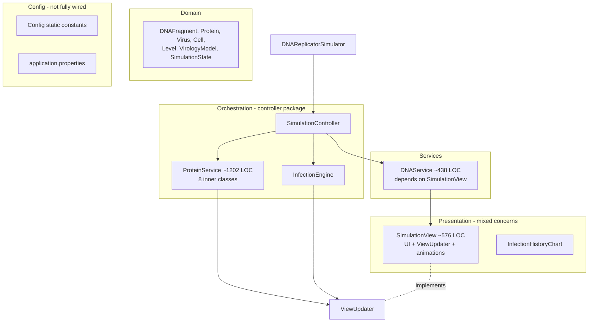
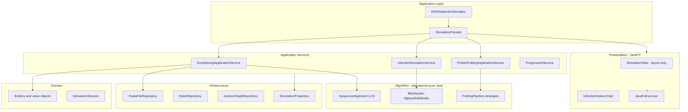
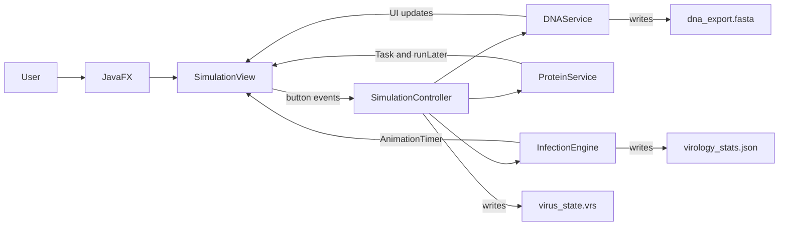
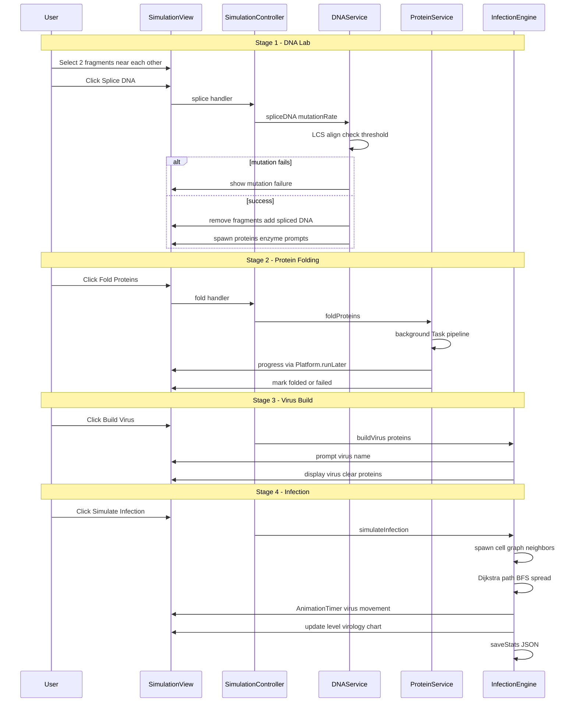

# DNA Replicator — Architecture

**DNA Replicator / Virus Builder Simulator v6** is an educational desktop game that teaches classic algorithms through a gamified virology workflow: splice DNA, fold proteins, assemble a virus, and simulate infection across a cell graph.

---

## Table of contents

1. [Technology stack](#technology-stack)
2. [Current package structure](#current-package-structure)
3. [Layered architecture (current vs target)](#layered-architecture-current-vs-target)
4. [Runtime component diagram](#runtime-component-diagram)
5. [Main player loop (data flow)](#main-player-loop-data-flow)
6. [Mechanics catalog](#mechanics-catalog)
7. [Persistence](#persistence)
8. [God classes and hotspots](#god-classes-and-hotspots)
9. [Dependency smells](#dependency-smells)
10. [Refactoring roadmap](#refactoring-roadmap)

---

## Technology stack

| Layer | Technology |
|-------|------------|
| Language | Java 21 |
| Framework | Spring Boot 3.4.4 (DI only, `web-application-type=none`) |
| UI | JavaFX 21 (`javafx-controls`, `javafx-graphics`, `javafx-media`) |
| Build | Maven |
| Serialization (target) | Jackson (`jackson-databind`) |
| Entry point | `com.xai.dnareplicator.DNAReplicatorSimulator` |

Spring Boot starts in JavaFX `init()`; the primary stage is created in `start()` with beans resolved from the application context.

---

## Current package structure

```
com.xai.dnareplicator
├── DNAReplicatorSimulator.java      # JavaFX Application + @SpringBootApplication
├── config/
│   └── Config.java                  # Static constants (partially duplicated in application.properties)
├── model/
│   ├── DNAFragment.java
│   ├── Protein.java
│   ├── Virus.java
│   ├── Cell.java
│   ├── Level.java
│   ├── VirologyModel.java
│   └── SimulationState.java
├── service/
│   └── DNAService.java              # DNA spawn, LCS splice, FASTA I/O
├── controller/                      # Misnamed: orchestration + heavy domain logic
│   ├── SimulationController.java
│   ├── InfectionEngine.java
│   ├── ProteinService.java          # ~1,200 LOC god class
│   ├── ViewUpdater.java
│   └── DNAProcessingException.java
└── view/
    ├── SimulationView.java          # UI + ViewUpdater implementation
    └── InfectionHistoryChart.java
```

---

## Layered architecture (current vs target)

### Current (flat, leaky boundaries)

Presentation, orchestration, algorithms, and persistence are interleaved. Services call concrete JavaFX views directly.



### Target (hexagonal / layered)

Algorithms are pure and testable. Application services orchestrate. Infrastructure handles I/O. JavaFX stays in presentation.



### Package mapping (migration guide)

| Current | Target |
|---------|--------|
| `model/*` | `domain/model/*` (no JavaFX, no JSON) |
| `service/DNAService` | `application/dna` + `algorithm/dna` + `infrastructure/persistence` |
| `controller/ProteinService` | `application/protein` + `algorithm/protein/*` |
| `controller/InfectionEngine` | `application/infection` + `algorithm/graph/*` |
| `controller/SimulationController` | `application/SimulationFacade` |
| `view/*` | `presentation/javafx/*` |
| `config/Config` | `config/SimulationProperties` + `@EnableConfigurationProperties` |
| `controller/ViewUpdater` | `presentation/contract/SimulationViewPort` |

---

## Runtime component diagram



---

## Main player loop (data flow)

The simulation is a linear pipeline with optional persistence between sessions.



---

## Mechanics catalog

Maps player actions to code and educational algorithms.

| UI action | Primary class | Algorithm / concept | Reference |
|-----------|---------------|---------------------|-----------|
| Splice DNA | `DNAService` | Longest Common Subsequence (DP table + traceback) | CLRS Ch. 15 |
| Splice DNA | `DNAService` | Alignment score threshold | Custom |
| Splice DNA | `DNAService` | Randomized mutation failure | CLRS Ch. 5 |
| Splice DNA | `DNAService` | Hash table fragment + LCS cache | CLRS Ch. 11 |
| Export DNA | `DNAService` | Merge sort by sequence length | CLRS Ch. 4 |
| Fold Proteins | `ProteinService` | Splay tree for amino acids | CLRS Ch. 17 |
| Fold Proteins | `ProteinService` | Fibonacci heap + approximation | CLRS Ch. 35 |
| Fold Proteins | `ProteinService` | HMM folding state prediction | Durbin |
| Fold Proteins | `ProteinService` | Genetic algorithm + simulated annealing | Heuristic search |
| Fold Proteins | `ProteinService` | MCTS pathway evaluation | Game tree search |
| Build Virus | `InfectionEngine` | Randomized assembly failure | CLRS Ch. 5 |
| Simulate Infection | `InfectionEngine` | BFS infection spread | CLRS Ch. 22 |
| Simulate Infection | `InfectionEngine` | Dijkstra optimal path | CLRS Ch. 24 |
| Level up | `Level` | Increasing fragments required + cell resistance | Game design |

---

## Persistence

| File | Format | Writer | Contents |
|------|--------|--------|----------|
| `resources/dna_export.fasta` | FASTA | `DNAService` | Fragment names and base-pair sequences |
| `resources/virus_state.vrs` | Custom text | `SimulationController` | DNA, proteins, virus, level, virology, mutation rate |
| `resources/virology_stats.json` | JSON | `InfectionEngine` | Infected/resistant counts and infection history |

**Risk:** `.vrs` uses comma-separated lines; DNA sequences containing commas will corrupt load. Target: versioned Jackson DTO (`StateRepository`).

---

## God classes and hotspots

| Class | Approx. LOC | Role today | Primary issues |
|-------|-------------|------------|----------------|
| **ProteinService** | 1,202 | Protein folding pipeline | 8 nested types; algorithms + threading + JSON + UI in one file |
| **SimulationView** | 576 | Main window | Layout, scene graph, drag handlers, sound, animations, `ViewUpdater` |
| **DNAService** | 438 | DNA operations | Embeds LCS and merge sort; depends on concrete `SimulationView` |
| **InfectionEngine** | 314 | Infection simulation | Graph algorithms + `AnimationTimer` game loop + JSON I/O |
| **SimulationController** | 239 | Orchestration + save/load | Fragile text persistence; wires all button handlers |

**Rule of thumb for refactors:** no production class should exceed ~300 LOC; extract inner classes to `algorithm.*` packages.

---

## Dependency smells

1. **`DNAService(SimulationView view)`** — Application logic depends on a concrete JavaFX component. Use `SimulationViewPort` (narrow interface) or domain events.

2. **`ProteinService(List<Protein> proteins, ViewUpdater viewUpdater)`** — Protein list must be shared with `DNAService` via a single `SimulationSession` bean.

3. **`ViewUpdater` only partially adopted** — `DNAService` bypasses the port; `InfectionEngine` and `ProteinService` use it.

4. **Static `Config` vs `application.properties`** — Duplicate configuration; properties file is not bound at runtime.

5. **`ProteinService` static `ExecutorService`** — Not lifecycle-managed by Spring; risk of thread leaks on shutdown.

---

## Refactoring roadmap

Aligned with [ROADMAP.md](ROADMAP.md) and [IMPLEMENTATION_GUIDE.md](IMPLEMENTATION_GUIDE.md).

### Phase A — Extract algorithms (behavior-preserving)

- `algorithm.dna.LongestCommonSubsequence`
- `algorithm.dna.MergeSortByLength`
- `algorithm.graph.BreadthFirstInfection`
- `algorithm.graph.DijkstraPathfinder`

### Phase B — Split ProteinService

Extract inner classes into `algorithm.protein.*`; retain `ProteinFoldingOrchestrator` + thin `ProteinFoldingApplicationService`. See IMPLEMENTATION_GUIDE for the full class list.

### Phase C — Introduce SimulationSession

Single bean holding `List<DNAFragment>`, `List<Protein>`, optional `Virus`, `Level`, `VirologyModel`. Injected into all application services.

### Phase D — Persistence adapters

- `FastaFileRepository`
- `VrsStateRepository` or Jackson-based `SimulationStateDto`
- `VirologyStatsRepository` (Jackson only)

### Phase E — Presentation cleanup

- Split `SimulationView` into `DnaCanvas`, `Toolbar`, `HudPanel` (FXML optional)
- `JavaFxExecutor` bean wrapping `Platform.runLater`
- Move `InfectionEngine` animation loop to `InfectionAnimationDriver`

---

## Related documents

- [ROADMAP.md](ROADMAP.md) — Phased delivery plan with priorities and estimates
- [IMPLEMENTATION_GUIDE.md](IMPLEMENTATION_GUIDE.md) — Coding standards, DI, testing, and refactor recipes
