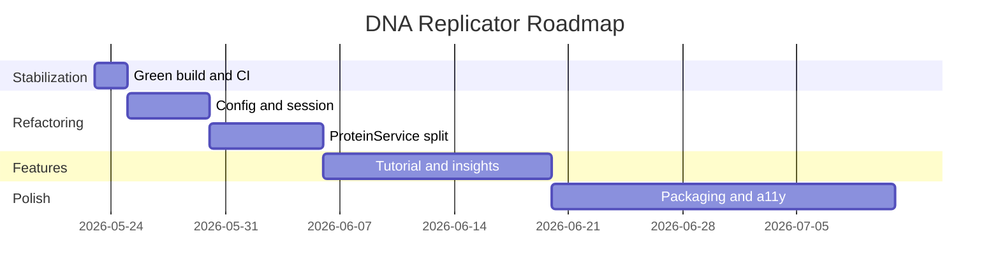

# DNA Replicator — Product Roadmap

This roadmap turns the architecture audit into a phased delivery plan. Effort uses **S** (small, &lt;1 day), **M** (medium, 1–3 days), **L** (large, 3+ days).

**Principles:** keep the educational + gamified experience; improve maintainability and testability; adopt proper Spring Boot and JavaFX practices.

---

## Overview

---

## Phase 0 — Stabilization (P0)

**Goal:** Project compiles, runs, and has a documented baseline.  
**Duration:** 1–2 days

| # | Item | Effort | Status criteria |
|---|------|--------|-----------------|
| 0.1 | Fix compile blockers | S | `mvn compile` succeeds |
| 0.2 | Migrate `org.json` → Jackson | S | No `org.json` imports |
| 0.3 | Fix `InfectionHistoryChart` package | S | Class in `com.xai.dnareplicator.view` |
| 0.4 | Add `SimulationProperties` + wire from `application.properties` | M | Static `Config` deprecated or delegates |
| 0.5 | Introduce `SimulationSession` shared state | M | Single protein/DNA ownership |
| 0.6 | Cross-platform JavaFX Maven profiles | S | `win` / `mac` / `linux` classifiers |
| 0.7 | Add `README.md` with run instructions | S | New contributor can launch app |
| 0.8 | CI: `mvn verify` on push | S | GitHub Actions or equivalent |
| 0.9 | Baseline unit tests (3–5) | S | `mvn test` passes |

### Compile fixes (verified blockers)

1. `import org.springframework.boot.autoconfigure.SpringBootApplication` in `DNAReplicatorSimulator`
2. `import com.xai.dnareplicator.config.Config` in `DNAService`
3. `package com.xai.dnareplicator.view;` in `InfectionHistoryChart`
4. Jackson DTOs for `VirologyModel`, `InfectionEngine`, `ProteinService` JSON usage
5. `spring-boot-configuration-processor` dependency

---

## Phase 1 — Refactoring (P1)

**Goal:** Clean layering, testable algorithms, no god classes.  
**Duration:** 1–2 weeks

| # | Item | Effort | Depends on |
|---|------|--------|------------|
| 1.1 | Extract DNA algorithms (`LCS`, merge sort) | M | 0.1 |
| 1.2 | Extract graph algorithms (BFS, Dijkstra) | M | 0.1 |
| 1.3 | Rename `ViewUpdater` → `SimulationViewPort`; decouple `DNAService` | M | 0.5 |
| 1.4 | ProteinService decomposition (see IMPLEMENTATION_GUIDE) | L | 1.1 |
| 1.5 | `InfectionAnimationDriver` (move `AnimationTimer` out of engine) | S | 1.2 |
| 1.6 | Replace `.vrs` text format with versioned Jackson state | M | 0.4 |
| 1.7 | `JavaFxExecutor` bean; audit FX thread safety | M | 1.3 |
| 1.8 | Spring-managed thread pool; shutdown on context close | S | 1.4 |

### Exit criteria (Phase 1)

- No class over 300 LOC in `src/main/java`
- Unit tests for all `algorithm.*` packages
- `DNAService` and `ProteinFoldingApplicationService` depend only on ports, not `SimulationView`

---

## Phase 2 — Features (P2)

**Goal:** Richer educational value and player progression.  
**Duration:** 2–4 weeks

| # | Item | Effort | Description |
|---|------|--------|-------------|
| 2.1 | Tutorial / onboarding | M | Step-by-step first run: splice → fold → build → infect |
| 2.2 | Algorithm insight panel | M | Show LCS alignment, path cost, fold composite score after actions |
| 2.3 | Externalized level definitions | S | JSON/YAML: `fragmentsRequired`, `cellResistance`, unlock text |
| 2.4 | Improved FASTA + codon table | M | Validate bases; educational codon → amino acid mapping |
| 2.5 | Undo/redo command stack | M | Session history for splice and fold |
| 2.6 | Multiple virus archetypes | M | Different efficiency/resistance curves per build |
| 2.7 | Challenge modes | L | Time limit, mutation-only splice, resistance gauntlet |

### Exit criteria (Phase 2)

- New player completes tutorial without reading source code
- At least one screen explains *which algorithm* ran and *why* the outcome occurred

---

## Phase 3 — Polish (P3)

**Goal:** Production-quality desktop experience.  
**Duration:** Ongoing

| # | Item | Effort | Description |
|---|------|--------|-------------|
| 3.1 | FXML + CSS theming | L | Separate layout from code; dark/light themes |
| 3.2 | Sound graceful fallback | S | Missing asset does not log stack traces |
| 3.3 | Accessibility | M | Keyboard navigation, focus order, readable labels |
| 3.4 | Desktop packaging | L | jlink, install4j, or jpackage MSI/dmg |
| 3.5 | Documentation site | S | GitHub Pages from `ARCHITECTURE.md` + guides |
| 3.6 | TestFX smoke tests | M | Button flows on CI with headless/monocle (optional) |
| 3.7 | Performance: spatial hash for cell neighbors | M | Replace O(n²) neighbor linking |

---

## Priority matrix

| Impact / Urgency | High | Medium | Low |
|------------------|------|--------|-----|
| **Now (P0)** | Green build, Jackson, package fix | README, CI | — |
| **Next (P1)** | SimulationSession, ProteinService split | `.vrs` → JSON state | Animation driver |
| **Later (P2)** | Tutorial, insight panel | Challenge modes | Multiple archetypes |
| **Eventually (P3)** | Packaging | FXML/CSS | TestFX |

---

## Immediate action plan (top 5)

Execute in order before starting Phase 1 refactors.

### 1. Restore a green build (~2–4 hours)

- Missing imports (`SpringBootApplication`, `Config`)
- Fix `InfectionHistoryChart` package
- Replace `org.json` with Jackson
- Verify: `mvn compile`

### 2. Fix Spring wiring for shared simulation state (~2 hours)

- `SimulationSession` bean with DNA fragments and proteins
- Wire `DNAService` and `ProteinService` to the same session
- Remove duplicate list ownership

### 3. Wire `application.properties` (~2 hours)

- `SimulationProperties` with prefixes `dna`, `protein`, `infection`, `simulation`
- Runtime data directory under `user.home/.dna-replicator` (optional)
- Deprecate static `Config` fields

### 4. Decouple services from concrete view (~4 hours)

- `SimulationViewPort` interface (evolve from `ViewUpdater`)
- `DNAService` accepts port, not `SimulationView`

### 5. Baseline documentation and smoke tests (~2 hours)

- `README.md`, 3–5 unit tests, CI workflow

---

## Technical debt and risks

| Risk | Severity | Phase | Mitigation |
|------|----------|-------|------------|
| Project does not compile | Critical | 0 | Phase 0 compile fixes |
| Wrong package on `InfectionHistoryChart` | Critical | 0 | Single-line fix |
| Duplicate protein lists / broken DI | High | 0 | `SimulationSession` |
| `.vrs` comma fragility in DNA | High | 1 | Jackson versioned state |
| Static `ExecutorService` in `ProteinService` | High | 1 | Spring-managed pool |
| UI updates off FX thread | Medium | 1 | `JavaFxExecutor` audit |
| Platform-specific JavaFX `win` only | Medium | 0 | OS Maven profiles |
| `DNAService` ↔ `SimulationView` cycle | Medium | 1 | Port interface |
| O(n²) cell neighbor graph | Medium | 3 | Cap cells + spatial index |
| Hardcoded `resources/` paths | Medium | 0 | Configurable base dir |
| No automated tests | High | 0 | JUnit baseline + CI |
| Educational overload in `foldProteins` | Low | 1 | Orchestrator + strategies |

---

## Success metrics

| Metric | Target (after Phase 1) |
|--------|------------------------|
| `mvn verify` | Passes on Windows, macOS, Linux CI matrix |
| Largest class LOC | &lt; 300 |
| Unit test count | ≥ 20 |
| Time to add new mechanic | &lt; 4 hours following IMPLEMENTATION_GUIDE |
| Cold start to playable | &lt; 10 seconds on mid-range hardware |

---

## Related documents

- [ARCHITECTURE.md](ARCHITECTURE.md) — System design and diagrams
- [IMPLEMENTATION_GUIDE.md](IMPLEMENTATION_GUIDE.md) — How to implement changes safely
